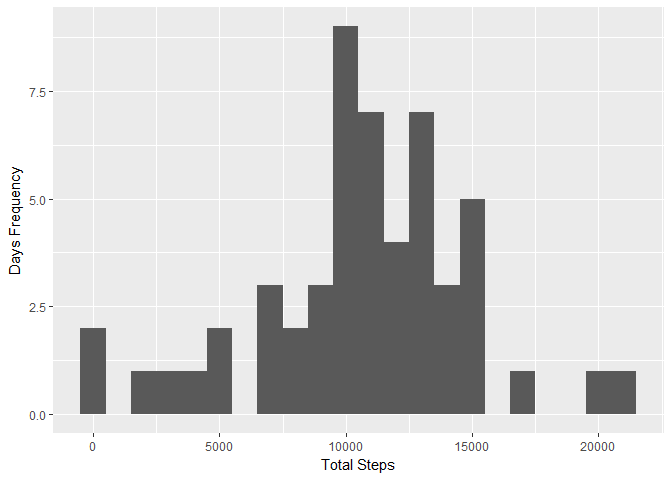
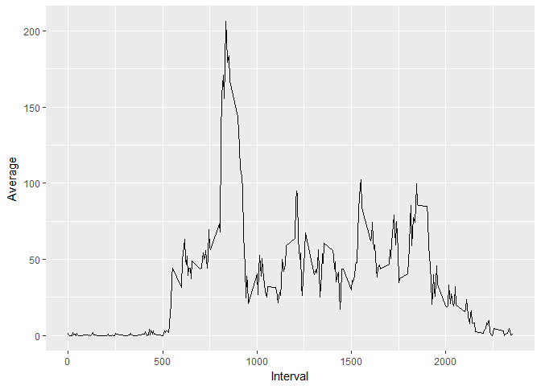
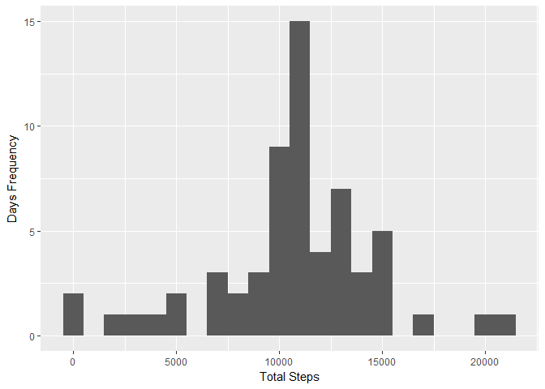
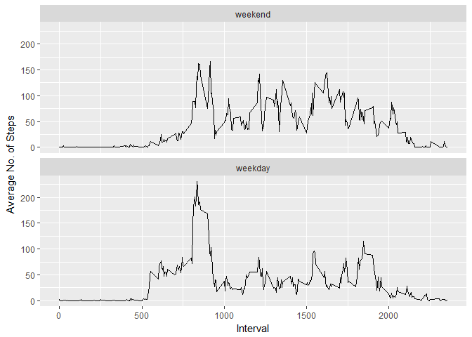

# Reproducible Research: Peer Assessment 1


## Loading and preprocessing the data
Here we the libraries required for this code to work and the data. 

```r
library(tidyverse)
```

```
## Loading tidyverse: ggplot2
## Loading tidyverse: tibble
## Loading tidyverse: tidyr
## Loading tidyverse: readr
## Loading tidyverse: purrr
## Loading tidyverse: dplyr
```

```
## Conflicts with tidy packages ----------------------------------------------
```

```
## filter(): dplyr, stats
## lag():    dplyr, stats
```

```r
library(lubridate)
```

```
## 
## Attaching package: 'lubridate'
```

```
## The following object is masked from 'package:base':
## 
##     date
```

```r
activity <- read.csv("activity.csv")
activity$date <- ymd(activity$date)
clean_act <- activity[complete.cases((activity)),]
```


## What is mean total number of steps taken per day?
For this question, we calculate the mean and median number of steps per day. 

```r
per_day <- clean_act %>% group_by(date) %>%summarise(total_steps=sum(steps))

qplot(per_day$total_steps, geom = "histogram", ylab = "Days Frequency", xlab = "Total Steps", binwidth = 1000)
```

<!-- -->

```r
mean(per_day$total_steps)
```

```
## [1] 10766.19
```

```r
median(per_day$total_steps)
```

```
## [1] 10765
```


## What is the average daily activity pattern?
For this question, we want to understand what is the average daily activity pattern. 

```r
daily_trend<- clean_act %>% group_by(interval) %>% summarise(average = mean(steps))
qplot(daily_trend$interval, daily_trend$average, geom = "line", xlab = "Interval", ylab = "Average")
```

<!-- -->


## Imputing missing values
Some prep work before we can imput the missing values.

```r
daily_trend[ which(daily_trend$average == max(daily_trend$average )),]
```

```
## # A tibble: 1 × 2
##   interval  average
##      <int>    <dbl>
## 1      835 206.1698
```

```r
copy_act<- activity
```
Imputing values based on the interval average.

```r
copy_act$steps <- ifelse(is.na(copy_act$steps) == TRUE, daily_trend$average[daily_trend$interval %in% copy_act$interval], copy_act$steps)   
```

Recalculating histogram, mean and median:

```r
new_per_day <- copy_act %>% group_by(date) %>%summarise(total_steps=sum(steps))

qplot(new_per_day$total_steps, geom = "histogram", ylab = "Days Frequency", xlab = "Total Steps", binwidth = 1000)
```

<!-- -->

```r
mean(new_per_day$total_steps)
```

```
## [1] 10766.19
```

```r
median(new_per_day$total_steps)
```

```
## [1] 10766.19
```


## Are there differences in activity patterns between weekdays and weekends?
Some prep work to identify weekdays and weekends:

```r
wkday_act <- copy_act

weekdays1 <- c('Monday', 'Tuesday', 'Wednesday', 'Thursday', 'Friday')
wkday_act$wDay <- factor((weekdays(wkday_act$date) %in% weekdays1), 
                   levels=c(FALSE, TRUE), labels=c('weekend', 'weekday')) 
```

Calculating and plotting:

```r
wk_avg<- wkday_act %>% group_by(interval, wDay) %>% summarise(average = mean(steps))
ggplot(data = wk_avg, aes(x= interval, y= average)) + geom_line() + facet_wrap(~wDay, ncol = 1)+labs(x= "Interval") +labs(y= "Average No. of Steps")
```

<!-- -->

